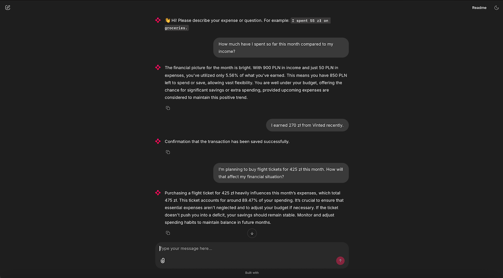

# Personal Transactions CrewAI Agents

A multi-agent system built with **CrewAI** to manage, analyze, and report on personal finances. This project incorporates **Azure** infrastructure for secure data handling and **Chainlit** for a chat interface.

---

## Tech Stack

* **Interface**: [Chainlit](https://chainlit.io/) – Real-time conversational UI for agent interaction.
* **Framework**: [CrewAI](https://www.crewai.com/) – Multi-agent orchestration.
* **Cloud & Database**: 
    * **Azure SQL** – Storage for financial records.
    * **Azure Logic Apps** – For transaction ingestion via HTTP triggers.
* **Language**: [Python](https://www.python.org/) – Core logic and agent execution.

---

## The Crew

The system uses four specialized agents to process financial data:

* **Transaction Processor**: Handles data entry via Chainlit. It sends validated transaction data to an **Azure Logic App** to trigger database inserts.
* **Database Developer**: Crafts optimized SQL queries against the Azure database to retrieve specific datasets.
* **Data Analyst**: Analyzes spending habits and trends in PLN, identifying outliers and budget deficits.
* **Report Editor**: Transforms complex data into a casual raport, no bullet points.

---

## Screenshots

| Chainlit Chat Interface |
|:---:|
|  |
| *Interactive UI for logging transactions and asking questions.* | *Real-time visibility into how agents use tools and SQL.* |

---

## Getting Started

### 1. Prerequisites
* Python 3.10+
* An OpenAI API Key
* An active **Azure Logic App** URL connected to an **Azure SQL** instance.

### 2. Installation
Clone the repository and install the required dependencies:

    git clone https://github.com/mariepcc/personal-transactions-crewai-agents.git

### 3. Configure Environment Variables
    OPENAI_API_KEY=your_api_key_here
    LOGIC_APP_URL=https://your-azure-logic-app-endpoint
    AZURE_SQL_CONNECTION_STRING=your_connection_string

### 4. Run the Crew  
To launch the Chainlit server and start the application, run: 

    cd app
    chainlit run main.py
